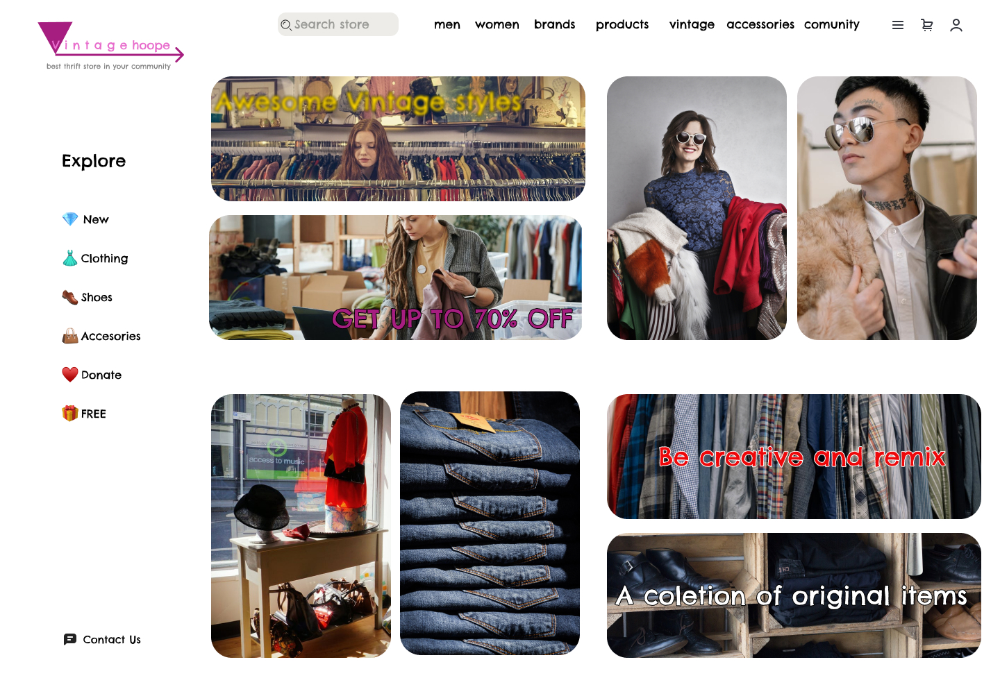

# 0006-thrift-store-design

**This is a design of an thrift store**

I made this this design of a thrift store website inside Figma software at https://www.figma.com    
It is the main landing page of an thrift store that sells clothes...    
I do want to mention the attributions for the assets that I used:  

- I used "Free Icon Pack 1600+ icons" made by "Leonid Tsvetkov" for more check https://www.figma.com/community/file/886554014393250663
- And some free stock pictures from pixabay.com that don't require attribution

